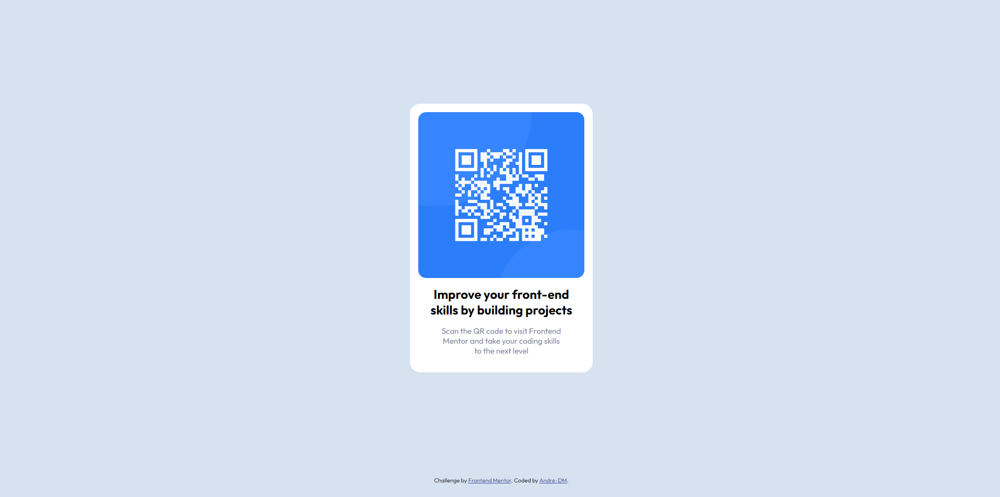

# Frontend Mentor - QR code component solution

This is a solution to the [QR code component challenge on Frontend Mentor](https://www.frontendmentor.io/challenges/qr-code-component-iux_sIO_H). Frontend Mentor challenges help you improve your coding skills by building realistic projects. 

### Screenshot

### Links

- Solution URL: [Add solution URL here](https://your-solution-url.com)
- Live Site URL: [Add live site URL here](https://your-live-site-url.com)

## My process

### Built with

- Semantic HTML5 markup
- CSS custom properties
- Mobile-first workflow

### What I learned

I took this opportunity to review the use of custom properties and try out nested selectors in CSS. I plan to include these features in my workflow in all future projects.

### Continued development

I would like to work more on layout management (margins, paddings, etc.), and place the various elements correctly even without the help of Flexbox and Grid.

### Useful resources

- [CSS Reset](https://www.joshwcomeau.com/css/custom-css-reset/) - I found this CSS reset very useful, I don't know if it can be safely implemented in all future projects (if so let me know when you leave feedback).

## Author

- Frontend Mentor - [@Andre-DM](https://www.frontendmentor.io/profile/Andre-DM)
